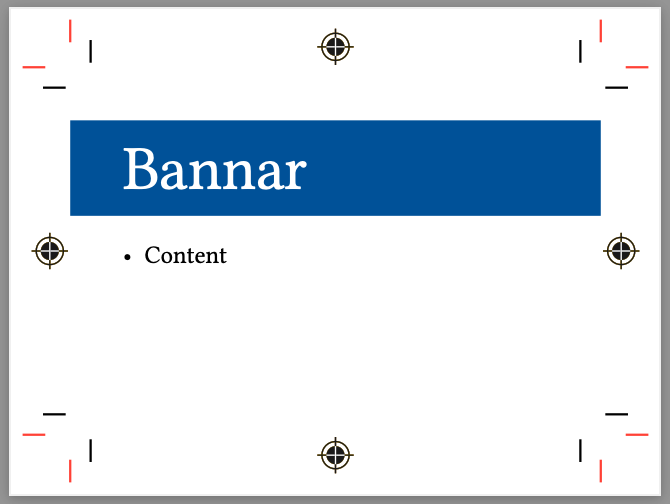

This is a Typst package to add cut, bleed, and registration marks to documents.


# Demo



...can be generated with:

```typst
#import "@preview/markly:0.2.0": *

#let markly_context = markly_setup(
  stock_width:4in,
  stock_height:3in,

  content_width: 3in,
  content_height:2in,
)

#show: markly_page_setup.with(markly_context)

// Here the local title template uses markly's to_bleed
#let title(body, inset_y:12pt) = {
  to_bleed(text(white, size:2.5em, body), markly_context)
}

#title[Bannar]

- Content
```


# Getting Started

    typst init @preview/markly:0.2.0


# Notes

Since this is a bit difficult to do there are some limitations to using this package.  Here are a few examples:

* `inside`/`outside` margins don't work on pages
* The `background` field of the `page` can't be used unless there is a wrapper function so that `marks` is called also.


# Usage

You need to import the package and setup parameters for the page setup.


```typst
#import "@preview/markly:0.2.0": *

// Set a dictionary of layout parameters that will be passed to other markly functions
#let markly_context = markly_setup(
  // stock_width:8.5in,
  // stock_height:11in,

  content_width:7in,
  content_height:5in,

  // bleed:9pt,

  // margin_width:.2in,
  // margin_height:.2in
)

// Configure the page to draw marks
#show: markly_page_setup.with(markly_context)

content...

```

Use `to_bleed`, `to_bleed_left`, or `to_bleed_right` to paint a background to the bleed marks.

Use `img_to_bleed` to stretch an image horizontally and vertically to the bleed marks.  The position of the "cursor" is not updated (like in the case of a background image) since it uses the `place` function.

See [demo.typ](demo.typ) and [demo.pdf](demo.pdf)


# Design

[Cetz](https://github.com/cetz-package/cetz) is used to draw the marks on the page's background.
